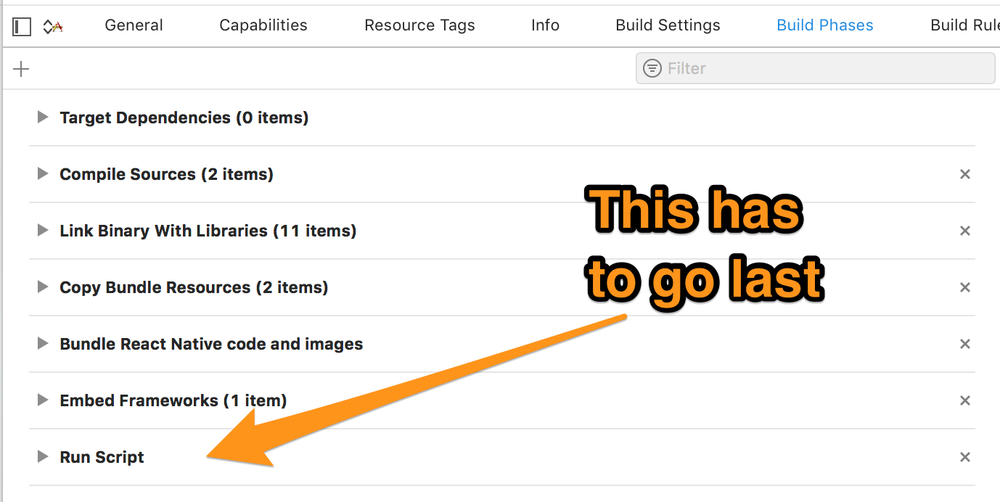

# iOS Setup

Some [Kontakt.io beacons prerequisites](https://developer.kontakt.io/android-sdk/quickstart/#setup) have to be met.

## Auto-linking (React Native v0.60+)

1. Add package

	```bash
	$ yarn add react-native-kontaktio
	```

2. Update pods

    ```bash
    $ cd ios
    $ pod install
    ```

3. Add permissions as described [below](#add-permissions).


## Mostly automatic setup (React Native older than v0.60)

When installing both, Android and iOS, steps _1_ and _2_ only have to be run once for both platforms.

1.  Install the package

    ```bash
    $ yarn add react-native-kontaktio
    ```

2. Link module (use `rnpm` for React Native versions older than `0.27`)

    ```bash
    $ react-native link react-native-kontaktio
    ```

3. Add permissions as described [below](#add-permissions).

## Manual setup

3. **(Skip for RN >= 0.60)** Manually link **Kontakt.io SDK**

    - Open the projects workspace in **XCode**

      	```
      	open ios/MyProjectName.xcodeproj
      	```
    - Select your build target in the **`Project navigator`**. Click **`General`** and then in the **`Embedded Binaries`** section, click the **`+`** button.

    	

    - Click **`[Add Other...]`**.
    - Navigate to **`node_modules/react-native-kontaktio/ios`**.

		

    - Add **`KontaktSDK.framework`**.
    - Leave the selection as is (don't copy to destination)

    	

    It should now also appear both in the **`Embedded Binaries`** section as well as in the **`Linked Frameworks and Libraries`** section below it.

4. **(Skip for RN >= 0.60)** Add Framework Search paths so that Xcode can find the added framework

    - Go to the **Build Settings** tab and search for **"framework search paths"**.
    - Add the following to _Framework Search Paths_ (select **recursive [v]**):

      	```
      	$(PROJECT_DIR)/../node_modules/react-native-kontaktio/ios
      	```

      

5. **(Skip for RN >= 0.60)** Add run script

    - In the **`Build Phases`** tab, click the **`+`** button at the top and select **`New Run Script Phase`**. Enter the following code into the script text field:

    ```
    bash "${BUILT_PRODUCTS_DIR}/${FRAMEWORKS_FOLDER_PATH}/KontaktSDK.framework/strip-frameworks.sh"
    ```
    

---

## Add permissions

Go to the **Info** tab and add in the top section **`Custom iOS Target Properties`** the following permissions:

- **Bluetooth**

    | Key                                 | Value                                    | Description                                                                           |
    | ----------------------------------- | ---------------------------------------- | ------------------------------------------------------------------------------------- |
    | NSBluetoothAlwaysUsageDescription | Your text of the permission for the user | A message that tells the user why the app needs access to Bluetooth. [See documentation for more information](https://developer.apple.com/documentation/bundleresources/information_property_list/nsbluetoothalwaysusagedescription) |

    Just copy-paste the key from here and the text will automatically change to the more elaborate version when you press enter (for example):

    


- **Location**

    Choose either the first or the second permission and if you target iOS versions earlier than iOS 11, add the third permission.

    | Key                                 | Value                                    | Description                                                                           |
    | ----------------------------------- | ---------------------------------------- | ------------------------------------------------------------------------------------- |
    | NSLocationWhenInUseUsageDescription | **iOS 11.0+** Grant permission to access location when the app is in use | A message that tells the user why the app is requesting access to the user’s location information while the app is running in the foreground. [See documentation for more information](https://developer.apple.com/documentation/bundleresources/information_property_list/nslocationwheninuseusagedescription) |
    | NSLocationAlwaysAndWhenInUseUsageDescription | **iOS 11.0+** Grant permission to access location when the app is in use and when it is in the background | A message that tells the user why the app is requesting access to the user’s location information at all times. [See documentation for more information](https://developer.apple.com/documentation/bundleresources/information_property_list/nslocationalwaysandwheninuseusagedescription) |
    | --- | --- | --- |
    | NSLocationAlwaysUsageDescription    | **DEPRECATED** in iOS versions 11.0+ - Use this key if your iOS app accesses location information in the background, and you deploy to a target earlier than iOS 11. | A message that tells the user why the app is requesting access to the user’s location information at all times (i.e. even when the app is in the background). [See documentation for more information](https://developer.apple.com/documentation/bundleresources/information_property_list/nslocationalwaysusagedescription) |

## Known Issues

* In case you run into the build error `Command PhaseScriptExecution failed with a nonzero exit code` check whether the `Run Script` in the `Build Phases` section is the last entry. If not, drag the `Run Script` down so that it is.

    
